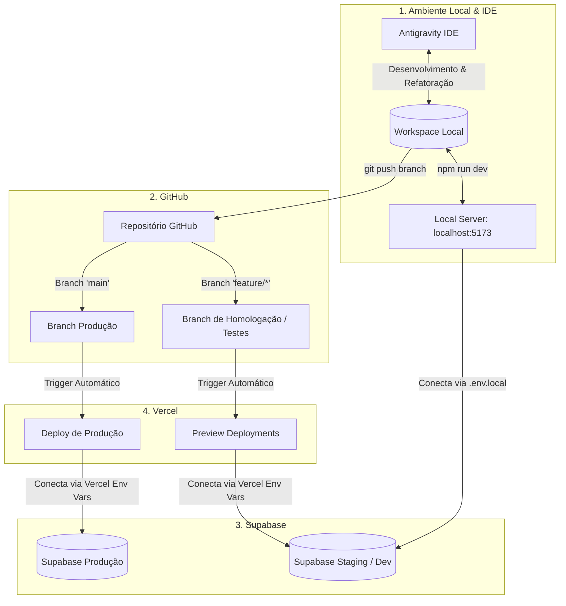
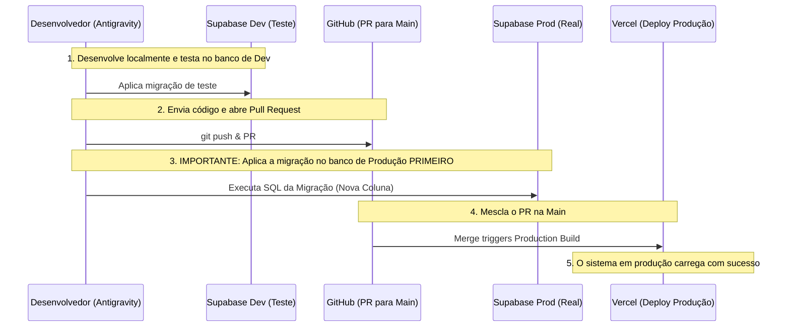

# 🚀 Guia de Desenvolvimento, Testes e Deploy - Arraial Odonto

Este guia descreve o fluxo de trabalho profissional, seguro e de alta performance para a manutenção e evolução do sistema da clínica **Arraial Odonto**. Ele integra o **Antigravity**, **GitHub**, **Supabase** e **Vercel** sob as melhores práticas de engenharia de software para sistemas em produção.

---

## 🗺️ Visão Geral do Fluxo de Trabalho (Pipeline)

O diagrama abaixo ilustra como as quatro plataformas trabalham juntas de forma coordenada:



---

## 1. Importação do Projeto para o Antigravity
Como o repositório da clínica já está ativo e foi clonado com sucesso no diretório local `c:\Clinica_ArraialOdonto`, o projeto já está pronto para desenvolvimento no Antigravity!

### Próximos Passos Iniciais na IDE:
1. **Instalação de Dependências**: Abra o terminal do Antigravity na pasta do projeto e execute:
   ```bash
   npm install
   ```
2. **Executar o Servidor de Desenvolvimento**: Para iniciar o projeto localmente:
   ```bash
   npm run dev
   ```
   O projeto estará acessível em `http://localhost:5173`.

---

## 2. Conectando ao Supabase com Segurança (Sem Perda de Dados)

> [!CAUTION]
> **NUNCA realize testes, inserções de dados falsos ou alterações de estrutura (DDL) diretamente no banco de dados de produção.**
> O banco de dados de produção do Arraial Odonto possui dados de pacientes, agendas e prontuários reais acumulados há 6 meses. Qualquer erro pode ser catastrófico e violar a LGPD (Lei Geral de Proteção de Dados).

### Como estruturar as conexões com segurança:

1. **Separação de Ambientes (Produção vs. Staging)**:
   * **Ambiente de Produção**: Utilizado pelos usuários da clínica em `arraialodonto.oxeai.com.br`. Conecta ao projeto Supabase ID `bacwlstdjceottxccrap`.
   * **Ambiente de Staging/Dev**: Crie um **segundo projeto gratuito no Supabase** (ou utilize o Supabase CLI para rodar o banco localmente via Docker). Esse banco de teste conterá dados fictícios para você e a IA testarem à vontade.

2. **Gerenciando as Chaves API (`.env`)**:
   * O projeto atualmente possui um arquivo `.env` contendo as chaves do Supabase.
   * **Problema de Segurança Atual**: O arquivo `.env` não está no `.gitignore`! Isso significa que suas chaves estão públicas no repositório do GitHub.
   * **Correção Recomendada**:
     1. Adicione `.env` e `.env.local` ao seu `.gitignore` imediatamente.
     2. Crie um arquivo `.env.example` sem as chaves reais (apenas a estrutura).
     3. Renomeie o arquivo local para `.env.local` e use as chaves do banco de dados de **desenvolvimento/teste** nele.
     4. Mantenha as chaves de **produção** configuradas exclusivamente nas variáveis de ambiente da Vercel.

3. **Arquitetura de Conexão no Vite**:
   O arquivo `src/integrations/supabase/client.ts` está configurado com chaves fallback. A melhor prática é ler das variáveis de ambiente com fallback para desenvolvimento:
   ```typescript
   const SUPABASE_URL = import.meta.env.VITE_SUPABASE_URL || "SUA_URL_DEV";
   const SUPABASE_PUBLISHABLE_KEY = import.meta.env.VITE_SUPABASE_ANON_KEY || "SUA_KEY_DEV";
   ```

---

## 3. Análise da Estrutura Atual do Sistema
Antes de realizar qualquer modificação, é vital entender a arquitetura herdada do Lovable:

### Estrutura de Pastas do Projeto:
* **`src/pages/`**: Contém as telas principais do sistema. Destaques:
  * `Agenda.tsx` (78.9KB): O coração do sistema. Um calendário complexo que gerencia consultas, horários e bloqueios. Exige extremo cuidado ao modificar.
  * `PatientDetails.tsx` e `ManagePatients.tsx`: Fluxo completo de cadastro, histórico clínico e upload de documentos.
  * `Administration.tsx` e `ManageProfessionals.tsx`: Módulo de controle de recepcionistas e profissionais.
* **`src/components/`**: Componentes reutilizáveis de interface (baseados em Shadcn UI e Radix).
* **`src/integrations/supabase/`**:
  * `client.ts`: Inicialização do cliente Supabase.
  * `types.ts` (39.9KB): Tipos de TypeScript gerados automaticamente a partir do schema do Supabase.
* **`supabase/migrations/`**: Contém 55 arquivos `.sql` de migração. Isso é excelente! Mostra que as alterações de banco de dados foram estruturadas passo a passo.

---

## 4. Implementação Segura de Alterações (Fluxo de Trabalho Git)

Sempre que precisar criar uma nova funcionalidade (ex: "Enviar lembrete de consulta por WhatsApp") ou corrigir um bug:

1. **Atualize sua branch local**:
   ```bash
   git checkout main
   git pull origin main
   ```
2. **Crie uma branch específica para a tarefa**:
   ```bash
   git checkout -b feature/lembrete-whatsapp
   # ou para correções:
   git checkout -b bugfix/ajuste-calendario
   ```
3. **Desenvolva com o Antigravity**:
   * Peça auxílio à IA para escrever o código de forma limpa.
   * A IA manterá o design system consistente com o Tailwind e Shadcn UI.
4. **Faça Commits Semânticos**:
   ```bash
   git add .
   git commit -m "feat: adiciona botão de envio de whatsapp na agenda"
   ```

---

## 5. Realização de Testes Antes de Publicar

Para garantir a estabilidade do sistema da clínica, use a seguinte pirâmide de testes:

| Tipo de Teste | Onde Executar | Objetivo |
| :--- | :--- | :--- |
| **Teste Local (Dev)** | `localhost:5173` | Validação imediata da lógica e do layout usando dados fictícios. |
| **Teste de Permissões (RLS)** | Supabase Staging | Fazer login como *Recepcionista* e depois como *Profissional* para garantir que as Row Level Security (RLS) policies estão bloqueando o acesso cruzado de dados de forma correta (conforme descrito no `PHASE_3_TESTS.md`). |
| **Preview Deployment** | URL temporária da Vercel | Testar a aplicação compilada na nuvem antes de unificar o código. |

---

## 6. Gerenciamento de Versões
* **Histórico de Alterações**: Sempre atualize a tabela de histórico de versões no `ADMIN_GUIDE.md` ou crie um arquivo `CHANGELOG.md` para documentar o que foi alterado.
* **Tags do Git**: Ao lançar grandes atualizações para a clínica, crie uma tag de versão no Git:
   ```bash
   git tag -a v1.1.0 -m "Release: Integração com WhatsApp e Ajustes na Agenda"
   git push origin v1.1.0
   ```

---

## 7. Fluxo Completo de Publicação (Deploy) e Atualizações em Produção

### Respondendo à sua principal dúvida:
> **"Quando o repositório do GitHub for atualizado, a Vercel atualizará automaticamente o sistema em produção? Ou existe algum processo adicional?"**

**Sim, a Vercel faz a atualização de forma 100% automática, mas com comportamentos diferentes por Branch:**

1. **Push em branches secundárias (ex: `feature/*`)**:
   * A Vercel detecta o push e gera um **Preview Deployment** (uma URL única e temporária).
   * Você pode abrir essa URL e testar o app exatamente como ele ficará em produção, sem afetar o sistema principal que os usuários estão usando.
   
2. **Merge/Push na branch `main`**:
   * Quando você aprova um Pull Request e mescla (`merge`) sua branch na branch `main`, a Vercel inicia automaticamente o build de **Produção**.
   * Em menos de 2 minutos, a URL oficial `arraialodonto.oxeai.com.br` é atualizada com a nova versão do código.

---

## ⚠️ O Grande Segredo: Sincronização Frontend vs. Banco de Dados

> [!IMPORTANT]
> **A Vercel NÃO atualiza o banco de dados do Supabase automaticamente.**
> O código do frontend (HTML/JS/TS) é implantado na Vercel, mas as tabelas, colunas, funções e políticas de segurança residem no Supabase.

Se a sua nova funcionalidade precisa de uma nova coluna no banco (ex: campo `status_whatsapp` na tabela `appointments`), siga rigorosamente este protocolo para evitar falhas em produção:



### Regras de Ouro para Migrações de Banco de Dados:
1. **Mudanças Retrocompatíveis**: Escreva scripts SQL de forma que a versão *antiga* do frontend continue funcionando mesmo depois que a migração for aplicada ao banco de produção. 
   * **Exemplo**: Se você for adicionar uma coluna, defina-a como opcional (`NULL`) ou dê a ela um valor padrão (`DEFAULT`). Nunca adicione uma coluna `NOT NULL` sem valor padrão a uma tabela existente em produção, pois os inserts da versão antiga do frontend irão falhar imediatamente.
2. **Execute as migrações de banco ANTES do deploy do frontend**:
   * Sempre execute suas novas migrações SQL (criando novas tabelas ou colunas) no console do Supabase de produção *antes* de mesclar o código da branch para a `main`. Dessa forma, quando a Vercel finalizar o deploy do novo frontend, os recursos de banco que ele necessita já estarão prontos e disponíveis.

---

## 🛠️ Prática Recomendada para Hoje: Organizando a Casa

Para iniciar os trabalhos na IDE com o pé direito, sugere-se a seguinte tarefa de organização (Fase de Setup Seguro):

1. **Adicionar o `.env` ao `.gitignore`**:
   Abra o arquivo `.gitignore` e certifique-se de ignorar arquivos de configuração de ambiente locais.
2. **Criar `.env.example`**:
   Documente as chaves que a aplicação precisa sem colocar os valores reais nelas.
3. **Mudar de Branch**:
   Evite commitar diretamente na branch `main`. Crie sua branch de trabalho `dev/setup-inicial` para testar os primeiros comandos!
